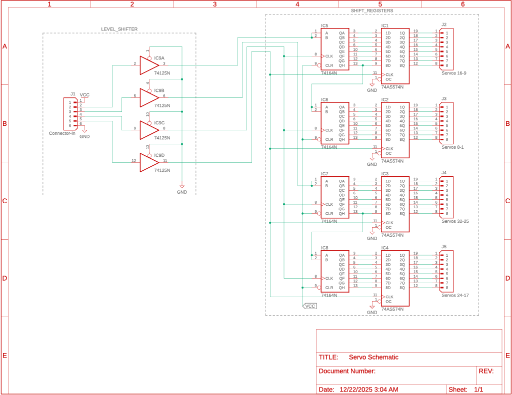

# ServoControl
&copy; 2025 Levi Johanon. All rights reserved.

ESP32-S3 Code and PCB design used for controlling up to 32 servos with 4 GPIO pins. Uses level shifters and d flip-flops on the pcb to control the servos. RMT is used on the ESP32-S3 to control the signals. The servos used are MG996R or any servo acceptiong a pwm from 1-2ms at 50Hz.

To learn more about using the code please see the README.md in the servo_controller folder.

## How Servos Work

  

Servos work by modulating a PWM signal sent into their control line. This signal is held high for 1ms, then some additional time based on the desired angle for the servo. 1.0 ms for 0 degrees, 1.5ms for 90 degrees, and 2.0 ms for 180 degrees. The line is then held low for the rest of the 20 ms period. The goal of this project is to control this PWM for all 32 servos.

## How it works

  

In the above simulation (simulation file is in hardware folder) there is an oscilliscope output with 3 signals labled clock, pulse, and servo. Also pictured are two 8-bit level shifters (SN74164) hooked together, with their outputs connected to two 8 bit D-flip-flop (SN74574). During each rising edge of the clock signal, the level of the servo signal is passed through the level shifter. Then at the rising edge of the pulse signal, those signals are copied into the D-flip-flop and is shown on the LEDs. As you can see, the white ellipses mark where the servo signal is high during a rising edge of clock and those signals are reflected in the LEDs.

The ESP32 code begins by calculating how long each servo needs to stay on based on the angle. Then every cycle a signal is sent through the servo line through the shift registers, then copied through the D flip-flops into the JST connectors that actually connect to the servos. There are two servo lines which each control 16 servos. On the actual PCB there are 5 2.50mm JST connectors. The first one from top to bottom is connected to VCC, Servo 1, Servo 2, Clock, Pulse, and Ground. The other 4 JST connectors each have 8 outputs and are connected to banks of servos. The servo numbers are labeled on the diagram and the PCB.

  

  

## Usage
In order to use, make the PCB using the information in the hardware file, follow the instructions involving the ESP32 code in the servo_controller file, and put it all together. Have fun and good luck.

## License
This project is licensed under the MIT License.  
© 2025 Levi Johanon. See the LICENSE file for details.
